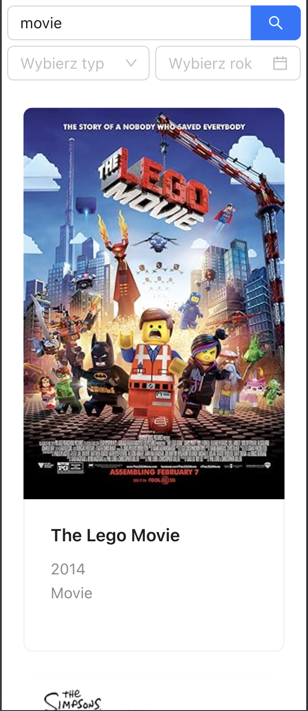
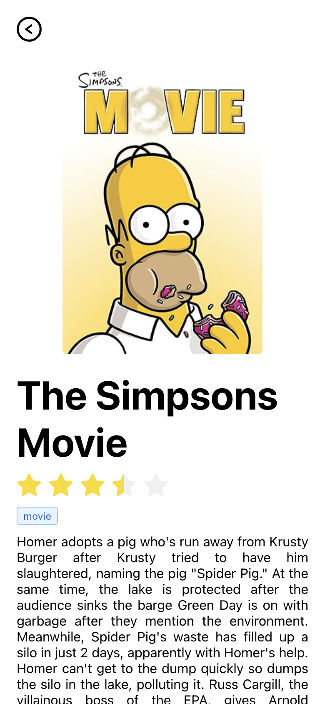
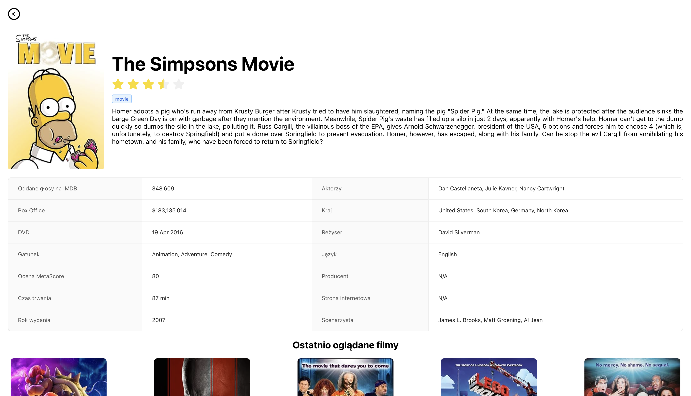

# IMDB Viewer

## :triangular_flag_on_post: Setup :triangular_flag_on_post:

Create a `.env` file in the root directory of the project. Then fill environment variables. You can take a look at the template file `.env.example`. This file should contain environmental variable `VITE_IMDB_API_KEY`.

The next step is to install globally package manager. This project uses [pnpm](https://pnpm.io/). To do that you will need to type in your terminal command like down below:

```sh
npm i -g pnpm
```

After successfully installing the package manager install dependencies.

```sh
pnpm install
```

## Commands

To run the project in the development mode

```sh
pnpm run dev
```

To build the project

```sh
pnpm run build
```

To run production-ready bundle

```sh
pnpm run preview
```

To run tests

```sh
pnpm run test
```

To run tests with UI

```sh
pnpm run test:ui
```

To format the project

```sh
pnpm run format
```

To lint the project

```sh
pnpm run lint
```

To build the production-ready docker image

```sh
pnpm run build-docker
```

To start the production-ready docker image

```sh
pnpm run start-docker
```

To build the docker image dedicated to working on the project in the container

```sh
pnpm run build-development-docker
```

To start the docker image dedicated to working on the project in the container

```sh
pnpm run start-development-docker
```

## App screenshots







